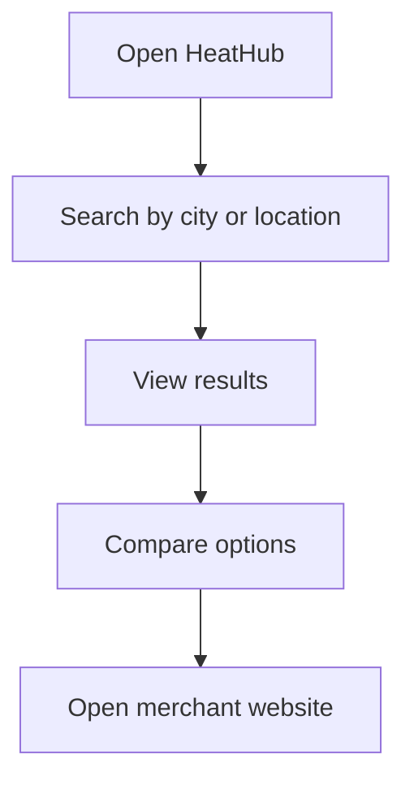

# 03 User Flows

## Main Search Flow

## Product Discovery Flow

1. User enters city and product keyword.
2. System returns product results.
3. User filters by delivery time, price, distance, category, or installation.
4. User opens a product detail page.
5. User clicks the official merchant link.

## Service Discovery Flow

1. User selects installation or repair.
2. User enters city or uses current location.
3. System returns relevant service providers.
4. User compares distance, availability, rating, and contact method.
5. User opens provider website or contact page.

## No Checkout Flow

HeatHub never creates an order.

After outbound redirect, the transaction happens outside HeatHub.
